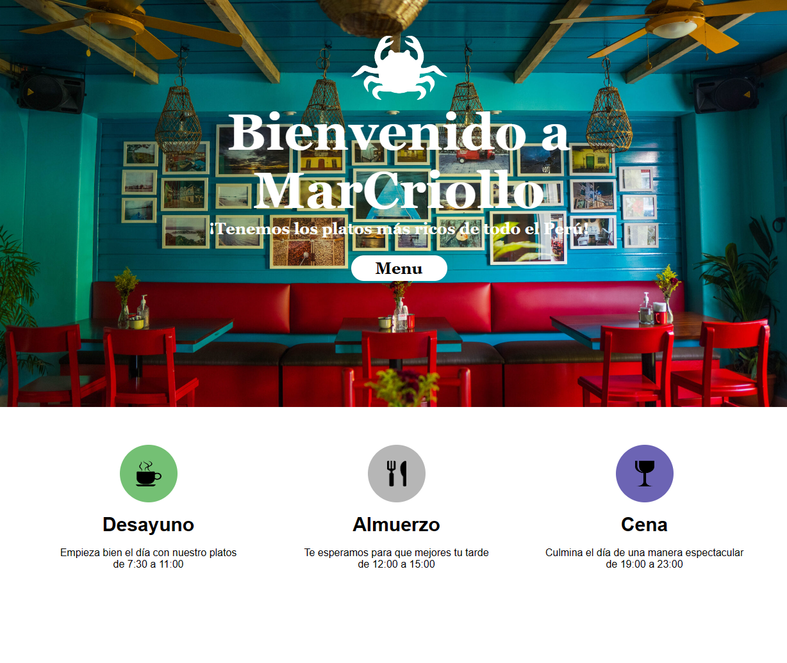
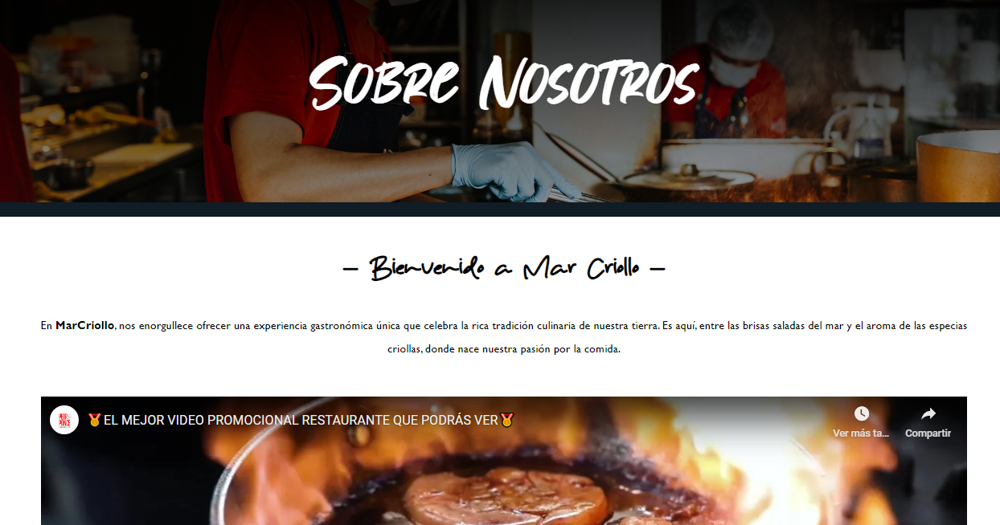
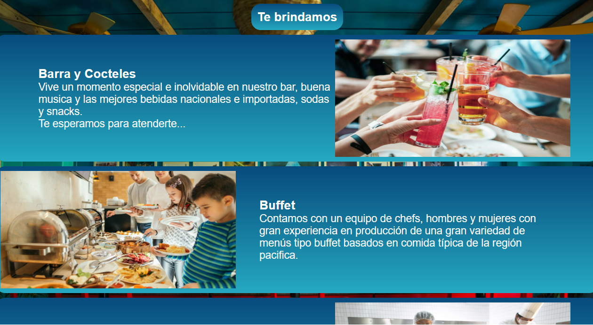
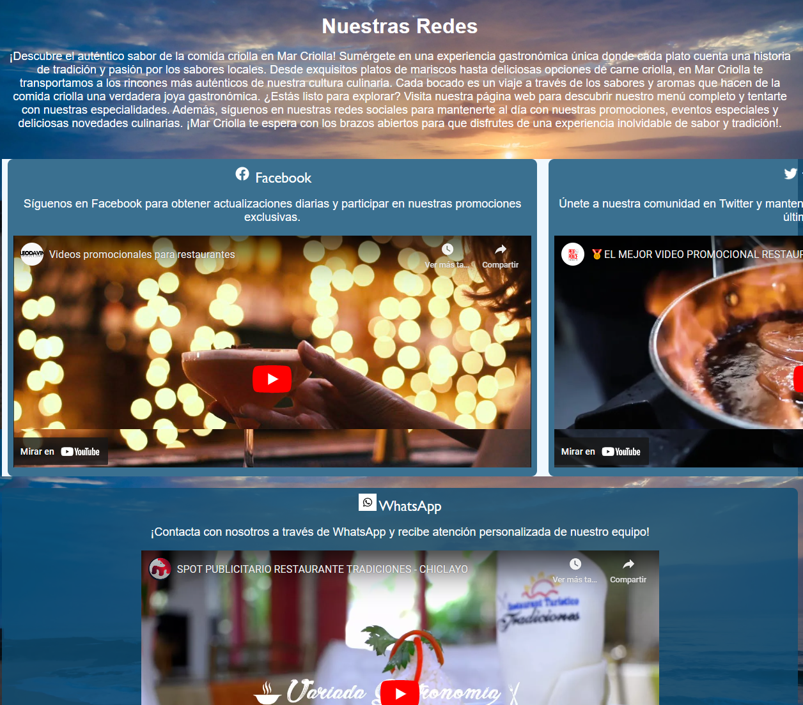
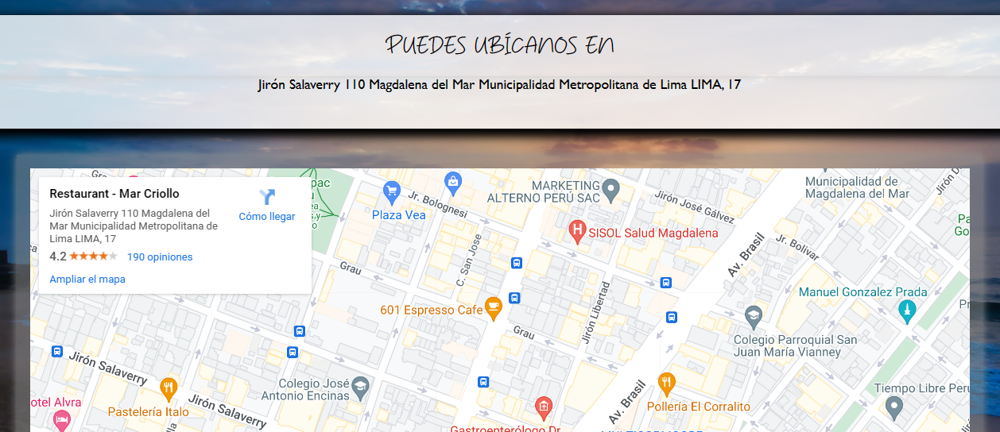
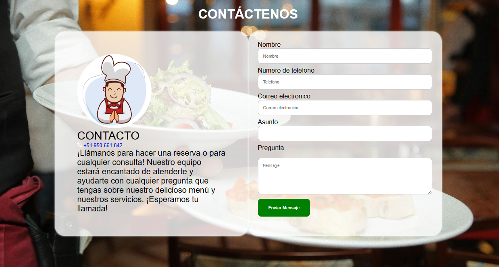

# Bienvenido al Repositorio de Desarrollo Web de MarCriollo
Este repositorio se ha creado con el propósito de facilitar el aprendizaje y desarrollo de páginas web utilizando HTML, CSS y JavaScript, utilizando como proyecto base el restaurante MarCriollo. :smiley:

## Avances Realizados
- [x] ~~Avance Trabajo Final 01~~ (ATF1)
- [X] ~~Avance Trabajo Final 02~~ (ATF2)
- [ ] Avance Trabajo Final 03 (ATF3) :shipit:
- [ ] Avance Trabajo Final 04 (ATF4)
- [ ] Avance Trabajo Final 05 (ATF5)
- [ ] Trabajo Final (TF) :skull:

## División de las paginas

### Inicio de Pagina:
Al comienzo se muestra un mensaje de bienvenida al cliente junto con un botón para acceder al menú de MarCriollo. Además, presenta los horarios en los que se sirven los distintos platos (desayuno, almuerzo y cena), así como los "Platillos del Día", destacando lo más importante del restaurante. Finalmente, ofrece una breve descripción de la oferta culinaria de MarCriollo :fish:.

### Inicio de Nosotros:
Se colocó un cuadro al comienzo con relacion a la página. Más adelante, se da un resumen corto sobre el restaurante con un video de demostración de las cualidades de la empresa. Además, se da una corta biografia sobre el fundador de **MarCriollo** :raised_hands:.

### Inicio de Servicios:
Encontrará un mensaje sobre lo que ofrece nuestro restaurante, seguido de una sección destacando nuestros principales servicios. Esta sección incluye una lista vertical de servicios destacados, cada uno con una imagen y un texto descriptivo.

### Inicio de Redes Sociales:
Se busca conocer todos los medios utilizados por el restaurante para generar contenido sobre sus platillos, servicios y el ambiente que ofrece en sus locales :iphone:.

### Inicio de Mapas:
Se proporcionan los medios necesarios para que el cliente pueda encontrar rápidamente nuestras sedes y obtener indicaciones detalladas sobre cómo llegar. Ya sea que esté buscando nuestro restaurante principal, sucursales o cualquier ubicación asociada.

### Inicio de Contactos:
Se ofrece un formulario donde el cliente puede introducir sus datos personales, lo que permite que un asesor del restaurante se comunique con él para ofrecerle asesoramiento o brindarle servicios adicionales :memo:.

